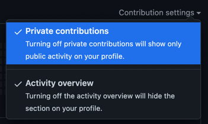
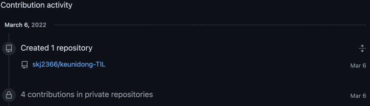

# GitHub 잔디는 private Repository에서는 심을 수 없다.

---
올해 들어 회사 사람들과 리액트 공부를 하기위하여 기본적인 공부를 위하여
각자 슬랙 화면을 클론하기로 했다. 
물론 완벽하게 따라하는 것은 아니고 구조 및 동작 일부분만 따라하는 것이다.

(물론 그마저도 지금은 ... 바이러스 확산세가 너무 쎄서 흐지부지 💩)

아무튼 과제를 진행하기 위하여 private repo를 만들어 어느 정도 진행을 한 후 오늘 커밋을 해보니 6일 및 7일 날짜로 잔디가 잘 들어갔다.

하지만 로그인을 하지 않고 깃허브 페이지를 확인하는 순간!?

이게 왠걸? 잔디가 덩그러니 비어있는것이다!
(지금은 다른 커밋을 하여 잔디가 채워진 상태)

이래저래 이유를 찾아보니 잔디를 보여주는 옵션이 따로 있었다.
잔디방 오른쪽 위의 Contribution settings 확인하여

Private Contributions 옵션을 켜주면 된다고 한다.

확인해 보니 contributions in private repositories 문구로 가려진채 커밋 이력이 남는것이 보인다!

보여주기 남 부끄럽더라도 PUBLIC으로 하는 것이 맞지만, 회사 업무 등 가릴 수 있는것은 가려야 하기에...
이력을 보여주고싶지만 못보여주면 너무 아쉽잖아?!

물론 앞으로 꾸준히 올려야 하고, 그것을 계속 유지 하는게 나의 목표이므로 열심히 농부를 할 예정이다. 
출근을 위해 20000 🥱